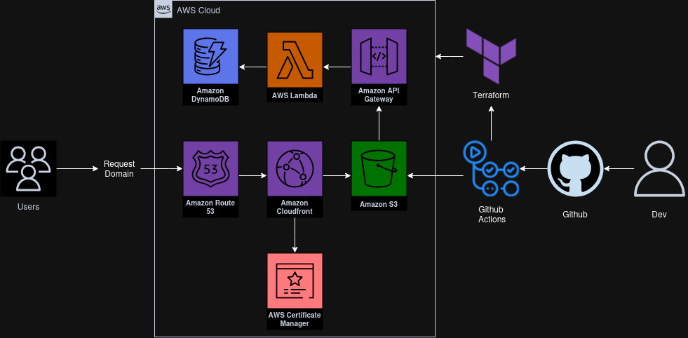

# Cloud Resume Challenge

## Introduction
The **Cloud Resume Challenge** is a hands-on project designed to build and deploy a serverless resume website using cloud technologies. This project helped me gain practical experience with AWS services, DevOps practices, and infrastructure as code.

## Features
- Static website hosted on AWS S3.
- Visitor counter powered by AWS Lambda and DynamoDB.
- HTTPS enabled via AWS CloudFront and ACM.
- Automated deployments with GitHub Actions.

## Technologies
- **AWS**: S3, Lambda, DynamoDB, CloudFront, Route 53, API Gateway
- **Frontend**: HTML, CSS, JavaScript
- **CI/CD**: GitHub Actions
- **IaC**: Terraform

## Live Website
Check out my resume website at [https://tonysottile.com](https://tonysottile.com)!